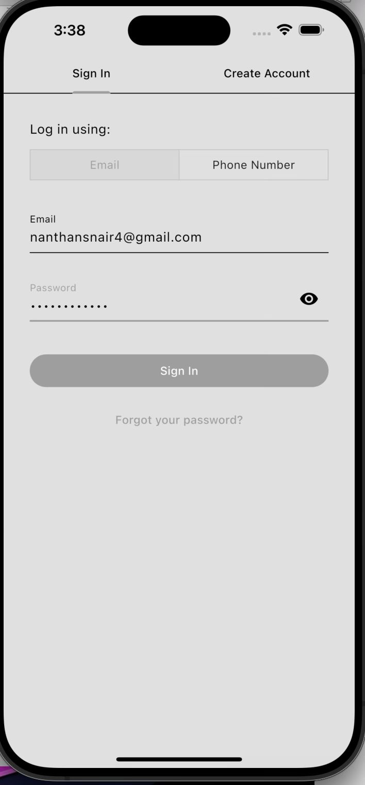
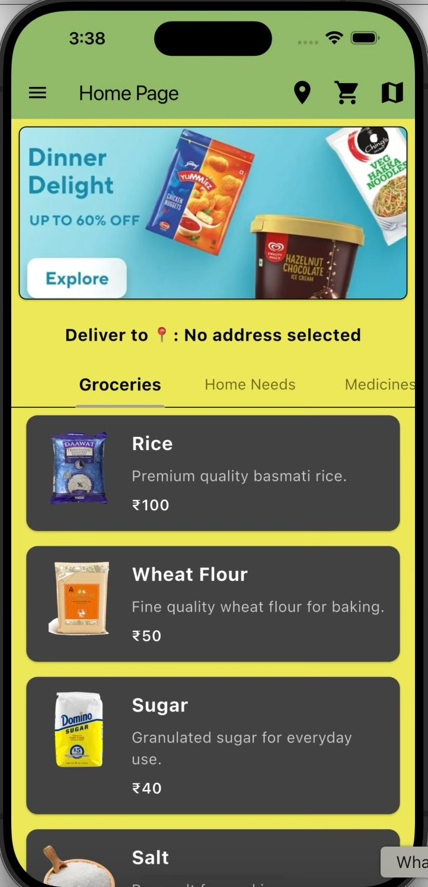
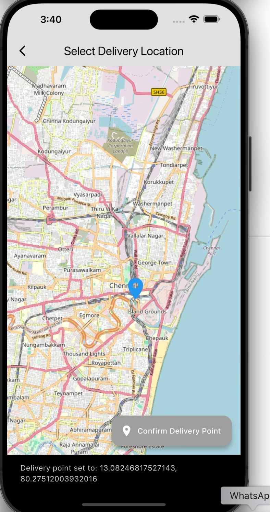
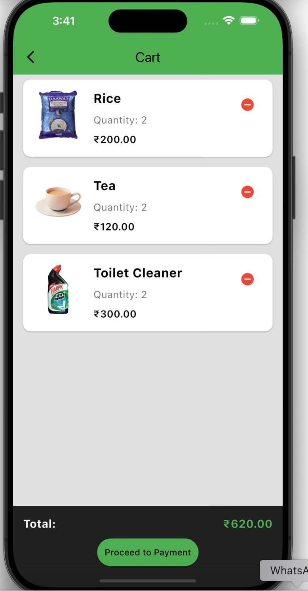
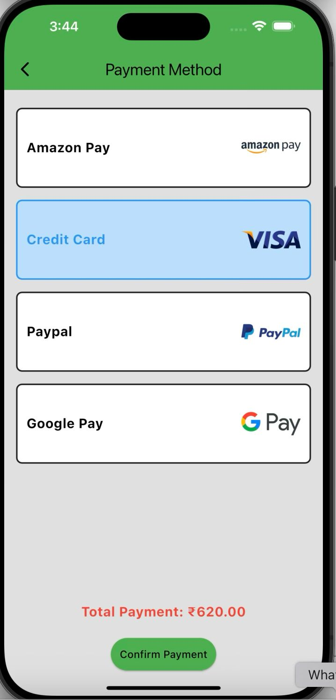
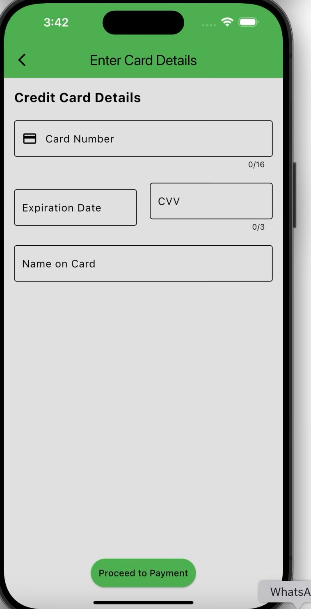
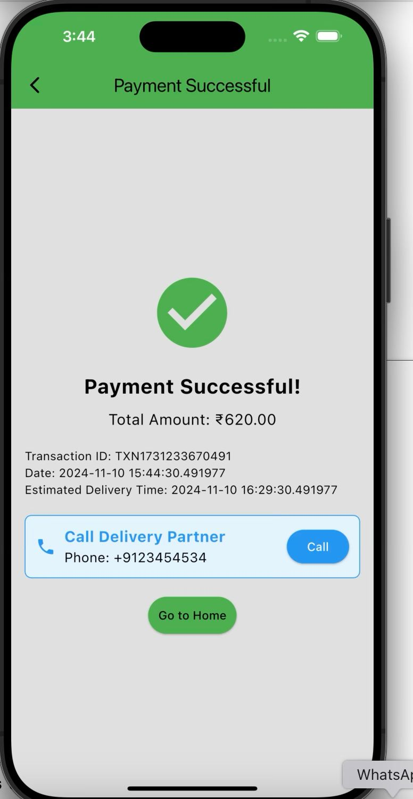

# **Essentio - Your Essential Needs in One App**

## 🚀 Overview
**Essentio** is a **Flutter-based mobile application** designed to streamline everyday essential purchases, including **groceries, medicines, home needs, and personal care products**. The app provides a **user-friendly interface** with categorized items, quantity variations, and a seamless shopping experience.

---

## ✨ Features
- 📦 **Categorized Essentials**: Groceries, medicines, home needs, and personal care items.
- 🔍 **Smart Search**: Quickly find items with intelligent suggestions.
- 📏 **Flexible Quantity Formats**: Supports units like kg, mg, liters, and custom measurements.
- 🛒 **Cart & Checkout**: Add items to your cart and place orders effortlessly.
- 🌙 **Dark Mode Support**: Enjoy a sleek UI with dark mode.
- 📊 **Order Tracking**: Monitor your purchases in real-time.

---

## 🏗️ Tech Stack
- **Frontend**: Flutter (Dart)
- **Backend**: Firebase / AWS Services
- **Database**: Firestore
- **State Management**: Provider / Riverpod
- **API Services**: RESTful APIs

---

## 📷 Screenshots
(Add screenshots here)
<div style="display: flex; flex-direction: row; justify-content: space-between; align-items: center;">
        
        
        
        
</div>
<div style="display: flex; flex-direction: row; justify-content: space-between; align-items: center;">
        
        
        
</div>

---

## 🔧 Installation
### **1️⃣ Clone the Repository**
```sh
git clone https://github.com/yourusername/essentio.git
```

### **2️⃣ Navigate to the Project Directory**
```sh
cd essentio
```

### **3️⃣ Install Dependencies**
```sh
flutter pub get
```

### **4️⃣ Run the App**
```sh
flutter run
```

---

## ⭐ Support
Give a ⭐ if you like this project!

